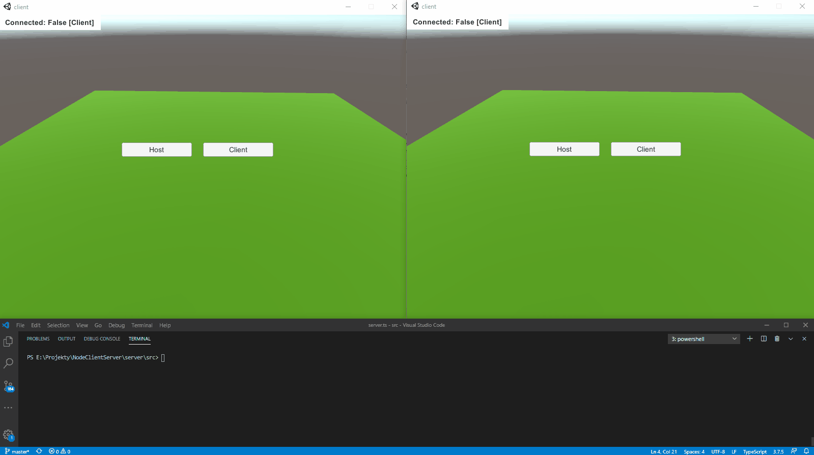

# Introduction
Basic framework for applications with peer to peer communication between clients with intermediary master server.
This is just proof of concept created in order to experiment with technologies - not production ready, but rather code base which can be eventually expanded for real-life use cases.

Initial inspiration for this small project was my curiosity, how well unique I/O model of nodeJS could perform as a backend master server for games.
Having such proof of concept done, I've added also simple Unity client as an example application.
As server and client are written in different technologies - server itself doesn't control or validate simulation itself - this should be achieved by introducing host - unity client with authority over running simulation. 
It means that server's code is completely independent from the game itself and can be used in totally different application.
However some common protocol for communication between clients and server is necessary - this is achieved by google protocol buffers https://developers.google.com/protocol-buffers



# Start local server
```node server/dist/src/server.js```

# Start client
```client/bin/client.exe```

# Edit protocol
Data structures which define simple protocol which is used in low-level communication between client and master server are defined in
```common/protobuf/communication_protocol.proto```

To regenerate code use .bat files from ```common/protobuf``` directly or use custom utility which is available in unity client.


